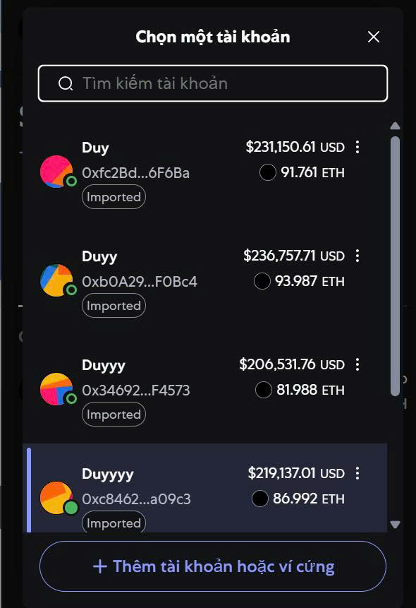
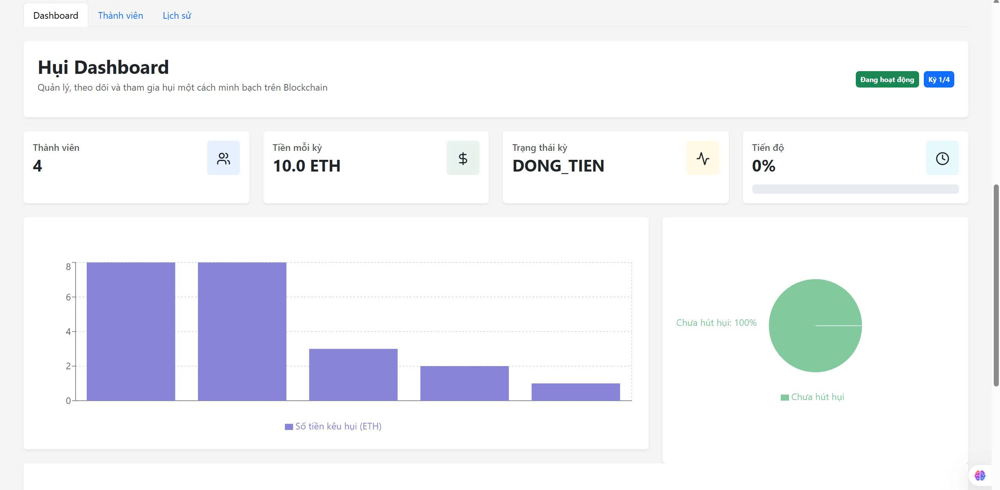
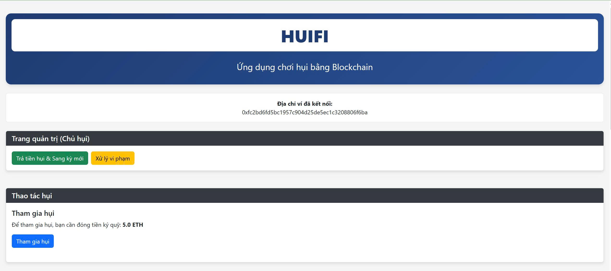
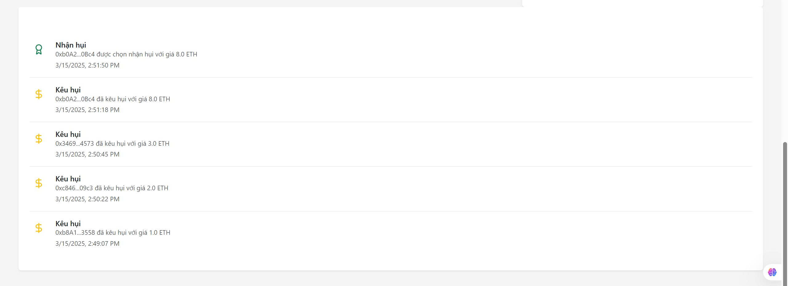
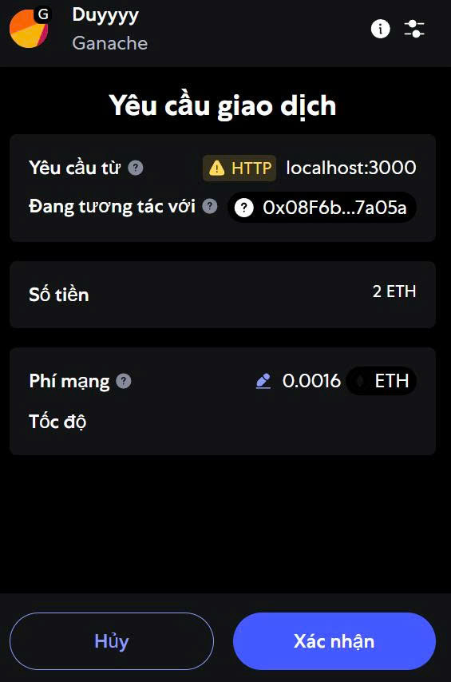

# 🪙 HUIFI – Ứng Dụng Chơi Hụi Blockchain

> **DApp quản lý chơi hụi minh bạch trên Ethereum – Đồ án nhóm UEL FinTech 2025**
>  
> Chơi hụi, đấu giá, quản lý đóng nhận minh bạch bằng smart contract. Giao dịch ETH qua MetaMask, testnet hoặc local Ganache.

---

## 🎉 Demo Giao Diện Thực Tế

| Kết nối ví & giao dịch trên MetaMask               | Chọn tài khoản để giao dịch                     |
|----------------------------------------------------|-------------------------------------------------|
|  |  |

| Lịch sử đấu giá, nhận hụi                          | Dashboard – Quản lý & Tham gia hụi              |
|----------------------------------------------------|-------------------------------------------------|
|  |  |

| Trang Admin (Chủ hụi) – Quản lý vòng chơi          |
|----------------------------------------------------|
|  |

---

## 🚀 Tính Năng Nổi Bật

- **Kết nối ví MetaMask:** Đăng nhập, xác thực và thực hiện giao dịch trực tiếp trên mạng local/testnet.
- **Tham gia hụi:** Nạp ký quỹ, tự động cập nhật số dư và trạng thái thành viên.
- **Kêu hụi & đấu giá:** Thành viên nhập giá nhận hụi, minh bạch đấu giá – ai đấu giá thấp nhất được nhận.
- **Đóng hụi, nhận hụi:** Quản lý vòng chơi, chuyển tiền cho người trúng hụi.
- **Trang admin (chủ hụi):** Chỉ chủ hụi có quyền sang vòng mới, trả tiền, xử lý vi phạm, hoàn tiền ký quỹ.
- **Lịch sử minh bạch:** Hiển thị toàn bộ lịch sử đấu giá, nhận hụi, thành viên, trạng thái vòng chơi.
- **Đa tài khoản MetaMask:** Hỗ trợ nhiều thành viên, kiểm tra vai trò & quyền tự động.

---

## ⚙️ Hướng Dẫn Chạy Ứng Dụng

### 1. Chuẩn bị
- **Cài đặt MetaMask** extension trên Chrome.
- **Chạy Ganache** (GUI hoặc CLI) trên máy để làm blockchain local.
- Import nhiều tài khoản Ganache vào MetaMask (nếu muốn test nhiều user).

### 2. Cài đặt và khởi chạy app

```bash
git clone https://github.com/<your-username>/<repo-name>.git
cd <repo-name>
npm install
npm start
````

* **Mở đúng trình duyệt/profile Chrome** đã login MetaMask.
* **Copy link [http://localhost:3000](http://localhost:3000)** vào tab đó.

### 3. Deploy lại hợp đồng (nếu muốn tự triển khai)

* Sửa các tham số trong `1_deploy_contract.js` (số thành viên, số kỳ, số tiền).
* Deploy lên local bằng Truffle/Hardhat:

  ```bash
  truffle migrate --network development
  ```
* Copy địa chỉ contract vừa deploy vào file config/constants.

---

## 📚 Quy Trình Chơi Hụi Trên DApp

1. **Connect Wallet:** Người chơi đăng nhập MetaMask, chọn tài khoản (ví dụ Duy, Duyy...).
2. **Đóng hụi/ký quỹ:** Thành viên nạp ETH vào smart contract (bấm Xác nhận trên MetaMask).
3. **Kêu hụi/Đấu giá:** Khi tới kỳ, thành viên nhập giá muốn nhận hụi.
4. **Nhận hụi:** Người giá thấp nhất được nhận, chủ hụi chuyển tiền ETH, xác nhận trên MetaMask.
5. **Sang kỳ mới:** Admin bấm nút chuyển vòng, thành viên tiếp tục đóng tiền cho kỳ tiếp theo.
6. **Kết thúc:** Sau đủ vòng, admin trả lại ký quỹ cho mọi thành viên.

---

## 🗂️ Cấu Trúc Thư Mục

```
├── src/
│   ├── App.jsx
│   ├── components/
│   ├── contexts/Web3Context.jsx
│   ├── assets/ (hoặc public/img/)
│   └── utils/
├── 1_deploy_contract.js
├── README.md
```

---

## 📖 Ghi chú kỹ thuật & trải nghiệm

* **Mọi giao dịch đều xác nhận trên ví MetaMask:** Giao diện sẽ hiện popup MetaMask, kiểm tra số tiền, phí gas trước khi xác nhận.
* **Không auto-connect ví:** Bạn phải bấm "Kết nối ví" và xác nhận quyền truy cập.
* **Test với nhiều account:** Đổi account trong MetaMask để thử vai trò thành viên/chủ hụi.

---

## 🧑‍💻 Đóng Góp & License

* Mọi đóng góp, issue hoặc pull request đều được chào đón!
* Phù hợp sinh viên, nhà phát triển, người học smart contract, fintech.

**License:** MIT

---

*Made with ❤️ by Group 5 – UEL FinTech | Contact: [duytd22414c@st.uel.edu.vn](duytd22414c@st.uel.edu.vn)*

```


